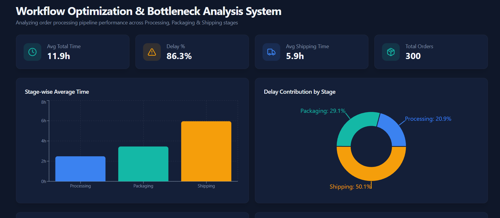
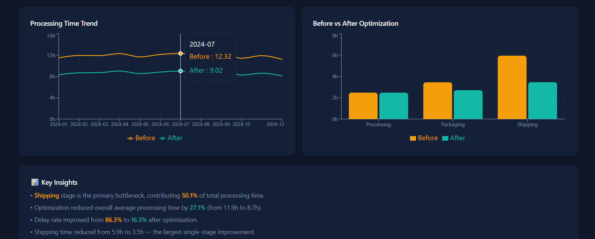

# 📊 Workflow Optimization & Bottleneck Analysis System

## 🚀 Overview
This project is a data-driven workflow optimization system built using Power BI to analyze operational inefficiencies and improve process performance.

It simulates a real-world order processing workflow with stages such as processing, packaging, and shipping, and identifies bottlenecks that cause delays.

---

## 🎯 Objective
- Identify inefficiencies in workflow stages  
- Detect bottlenecks contributing to delays  
- Optimize process performance using data-driven insights  
- Compare performance before and after improvements  

---

## 📊 Features
- 📈 Stage-wise performance analysis  
- 🚨 Bottleneck detection (highest delay contributor)  
- ⏱️ KPI tracking (Avg Time, Delay %, Total Orders)  
- 🔄 Before vs After comparison  
- 📉 Trend analysis of processing time  
- 💡 Actionable insights for optimization  

---

## 📁 Dataset
The dataset is synthetically generated and includes:

- `Order_ID`  
- `Order_Date`  
- `Processing_Time`  
- `Packaging_Time`  
- `Shipping_Time`  
- `Total_Time`  
- `Status (Delayed / On-Time)`  

### Data Variants:
- **Before_Process** → Original workflow  
- **After_Process** → Optimized workflow  

---

## 🧠 Key Concepts Used
- Data Analysis & KPI Evaluation  
- Bottleneck Identification  
- Process Optimization Logic  
- Data Visualization  
- DAX (Data Analysis Expressions)  

---

## 🛠️ Tools & Technologies
- Power BI  
- DAX  
- Excel / CSV  

---

## 📊 Dashboard Highlights
- KPI cards for performance tracking  
- Bar chart for stage comparison  
- Pie chart for delay contribution  
- Line chart for trend analysis  
- Before vs After comparison visuals  

---

## 📌 Insights
- Identifies the stage contributing most to delays  
- Highlights inefficiencies in workflow  
- Demonstrates measurable improvement after optimization  

---

## 🏆 Outcome
The system enables better decision-making by providing clear insights into workflow performance and helps reduce delays through targeted optimization.

---
## 📸 Dashboard Preview

### Dashboard View 1

### Dashboard View 2

## 📎 How to Use
1. Load dataset into Power BI  
2. Create measures using DAX  
3. Build visuals as per dashboard layout  
4. Analyze bottlenecks and improvements  

---

## ⭐ Project Value
This project demonstrates strong skills in:
- Business problem-solving  
- Data analysis  
- Dashboard design  
- Operational optimization  

---
